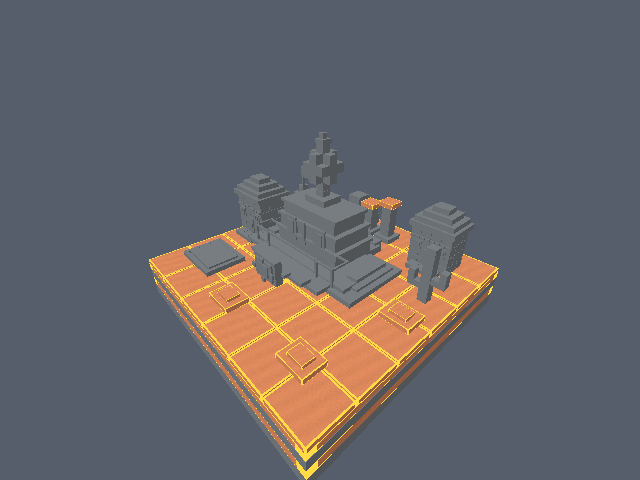
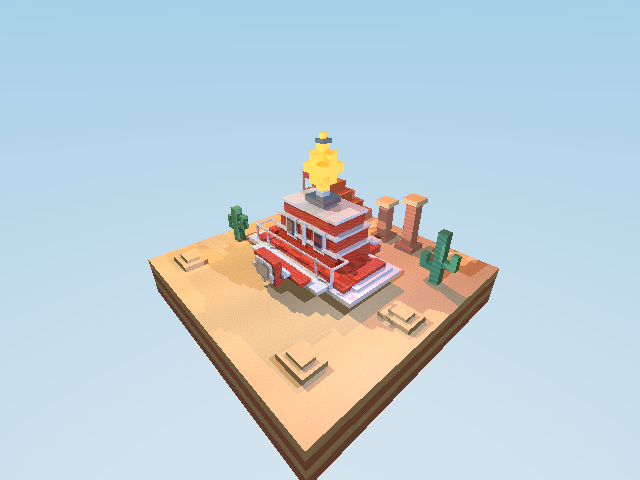

# Proyecto 2 — Dioramas con raytracing

Renderer de CPU en Rust para tres dioramas: Mario Odyssey, Mario Galaxy y NSMB Wii. Conserva geometría AABB con UV por cara, texturas procedurales, sombras, reflexión, refracción, emisión y skyboxes por escena.

## Ejecutar

El comportamiento normal abre una ventana interactiva y la mantiene activa hasta cerrarla:

```bash
cargo run --release
```

El framebuffer se renderiza en paralelo por filas y se presenta después de cada frame. El render interno predeterminado es `320×240` y se escala a una ventana inicial de `1280×960`; la ventana es redimensionable y conserva la proporción con franjas negras mediante un escalador propio. Esto evita un fallo de `AspectRatioStretch` en el backend Wayland de minifb 0.26. No se crea ningún `render.ppm` al ejecutar así.

Controles:

| Tecla | Acción |
| --- | --- |
| Flechas o `WASD` mantenidas | Orbitar y elevar/bajar la cámara continuamente |
| `+` / `-` mantenidas | Zoom continuo |
| `R` mantenida | Rotar el diorama continuamente |
| `M` | Activar/desactivar inspección de materiales |
| `Tab` / `T` | Abrir la inspección directamente o recorrer los materiales presentes |
| `J` / `L` mantenidas | Cambiar el ángulo horizontal de la luz principal |
| `I` / `K` mantenidas | Subir/bajar el ángulo de la luz principal |
| `H` | Restablecer la iluminación original del mundo |
| `Q` / `E` | Quitar/añadir una energiluna en Odyssey (0–20) |
| `N` | Transición al siguiente mundo: Odyssey → Galaxy → NSMB Wii → Odyssey |
| `1` / `2` / `3` | Transición directa a Odyssey / Galaxy / NSMB Wii |
| `F11` | Sin acción: minifb 0.26 no ofrece una API pública y verificable para fullscreen |
| `Esc` o cerrar la ventana | Salir |

La minimización y cualquier fullscreen solicitado al sistema quedan a cargo del window manager. No se simula fullscreen con una API inexistente.

## Bloques y materiales

Odyssey conserva su nave voxel y ahora incorpora casas inspiradas en las referencias
`Desierto1.png` y `Desierto2.png`: fachadas turquesa/magenta, niveles amarillos,
ventanas enmarcadas, franjas decorativas y cúpulas hechas con cuboides escalonados.
El terreno rojizo se divide en una cuadrícula de bloques de 2 unidades con juntas;
las casas se construyen con bloques de 0.50/0.55 unidades. Cada tamaño responde a
una escala de construcción, y los bordes permanecen visibles al orbitar.

Todos los bloques usan intersección rayo-AABB y UV por cara. Las texturas se generan
en el proyecto mediante funciones de `u/v`; no son únicamente colores constantes.
La BVH descarta grupos de bloques que el rayo no cruza y acelera también las sombras.
Las figuras, matemáticas, texturas y efectos se implementan en Rust dentro del
proyecto; minifb presenta la ventana, Rayon paraleliza las filas y png exporta imágenes.

Cinco materiales que pueden mostrarse durante la presentación:

| Nombre en el inspector | Textura propia | Albedo RGB | Specular | Transparencia | Reflectividad |
| --- | --- | --- | ---: | ---: | ---: |
| `sand` | Granos y ondulaciones de arena rojiza | 0.89, 0.29, 0.12 | 0.04 | 0.00 | 0.00 |
| `stucco-teal` | Estuco granular turquesa de las casas | 0.02, 0.58, 0.51 | 0.10 | 0.00 | 0.00 |
| `brick` | Patrón rojo con juntas escalonadas | 0.82, 0.07, 0.03 | 0.18 | 0.00 | 0.04 |
| `metal` | Paneles con variación de acabado | 0.78, 0.82, 0.90 | 0.70 | 0.00 | 0.34 |
| `water` | Ondas procedurales | 0.08, 0.35, 0.52 | 0.85 | 0.62 | 0.16 |

El oasis usa agua refractiva con IOR 1.33, Fresnel de Schlick y reflexión interna total.
Su fondo tiene baldosas contrastantes para observar la transmisión/distorsión en el
render normal. El inspector es una vista diagnóstica: muestra la textura y la forma,
pero no calcula reflexión ni refracción. Para apreciar esos efectos, volver con `M`.

Otros materiales de Odyssey: `sandstone` (estratos), `cactus` (costillas),
`stucco-yellow` y `stucco-magenta` (patrones de estuco distintos), `cloud` (acabado
claro), `dark` (acabado oscuro) y `star` (dorado emisivo). Cada uno tiene su propia
configuración; la rúbrica puntúa como máximo cinco materiales, no limita la cantidad.

Al activar `M`, el material elegido conserva su textura con contornos dorados y el
resto de la escena se muestra gris. Antes `Tab` requería activar `M`: ahora `Tab` o
`T` abre directamente el inspector y las siguientes pulsaciones recorren los materiales.
El nombre, índice y los cuatro parámetros aparecen en un panel dentro de la ventana,
además del título y la terminal. `M` sale de la inspección. Rotación y zoom siguen disponibles; iniciar una transición sale de
la inspección y vuelve al render normal de los tres mundos.

La inspección también se puede exportar sin ventana:

```bash
cargo run --release -- --headless --scene 0 --inspect-material stucco-teal --width 640 --height 480 --output /tmp/inspeccion-casas.png
cargo run --release -- --headless --scene 0 --inspect-material water --width 640 --height 480 --output /tmp/inspeccion-agua.png
```

Se rechazan nombres desconocidos y materiales que no estén presentes en la escena.
Las capturas de inspección de entrega están en `artifacts/inspection/`.

## Luz y energilunas interactivas

`J/L` gira la luz principal alrededor del diorama y `I/K` cambia su elevación,
con límites para mantenerla sobre el horizonte. `H` restablece sus ángulos.
Las luces de relleno y contorno permanecen fijas. Los desplazamientos angulares se
conservan al viajar entre mundos. El panel muestra sus valores en grados.
Para apreciar sombras y reflejos hay que salir del inspector con `M`: este es diagnóstico,
no una vista de iluminación física.

En Odyssey, cada pulsación de `E` añade una energiluna y `Q` quita una, hasta
un máximo de 20. El globo sigue formado por 21 cubos y cambia de tamaño con
smoothstep durante **0.5 s**, manteniendo fija su base; no se convierte en esfera.
Comienza con 10 energilunas. El panel muestra cantidad y porcentaje de llenado.
El estado se conserva al regresar a Odyssey y se congela durante el viaje.
Es una interacción simbólica de llenado, no una mecánica de recolección de personajes.

Estos estados se pueden reproducir sin ventana; los ángulos son desplazamientos
en grados respecto a la luz original y `--hud` incluye el panel en el PNG:

```bash
cargo run --release -- --headless --scene 0 --moons 0 --hud --width 640 --height 480 --output /tmp/globo-vacio.png
cargo run --release -- --headless --scene 0 --moons 20 --hud --width 640 --height 480 --output /tmp/globo-lleno.png
cargo run --release -- --headless --scene 0 --light-azimuth 70 --light-elevation -10 --hud --width 640 --height 480 --output /tmp/luz-lateral.png
cargo run --release -- --headless --scene 0 --inspect-material water --hud --width 640 --height 480 --output /tmp/material-panel.png
```

Capturas y hashes: [controles interactivos](artifacts/controls/manifest.json).



[Estuco de las casas](artifacts/inspection/stucco-teal.png) ·
[Ladrillo](artifacts/inspection/brick.png) · [Metal](artifacts/inspection/metal.png) ·
[Agua](artifacts/inspection/water.png)

Para exportar explícitamente un PPM sin ventana:

```bash
cargo run -- --headless --scene 0 --width 320 --height 240 --output odyssey.ppm
# --render es un alias de --headless
```

Use una ruta terminada en `.png` para exportar PNG; cualquier otra extensión conserva PPM.

El modo headless exige `--output`; así `cargo run` y un headless incompleto no crean
`render.ppm` accidentalmente. Para medir doce frames con órbita continua y comprobar
que el framebuffer cambia:

```bash
cargo run --release -- --benchmark --scene 0 --width 320 --height 240
```

`--scene` acepta `0` (Odyssey), `1` (Galaxy) o `2` (NSMB Wii). El modo headless es útil para smoke tests y exportación; los renders generados deben mantenerse fuera del working tree o ignorados.

## Requisitos

- Rust estable y Cargo.
- En Linux, un servidor X11/Wayland para `cargo run`; en CI sin display puede usarse `xvfb-run`.
- `minifb` proporciona la ventana y el blit del framebuffer. El raytracer permanece implementado en el proyecto, sin motor gráfico externo.

## Arquitectura adoptada

Se consultó directamente la rama pública [`18-RT-06-REFLECTIONS`](https://github.com/menene/cc2018-2026-02-10/tree/18-RT-06-REFLECTIONS) del repositorio de referencia. Se adaptó su patrón técnico de `minifb`: `Vec<u32>` como framebuffer, `Window::is_open`, polling de teclado, cámara orbital y `update_with_buffer`. La adaptación conserva la arquitectura y los materiales propios del Proyecto 2; no se incorporó su historial ni se copió su escena.

La ventana rerenderiza cuando cambia la cámara o la escena; las teclas mantenidas usan
delta-time para movimiento continuo. `WorldTransition` conserva explícitamente mundo
origen/destino, progreso acotado `0..1`, cámara interpolada y duración fija de **0.8 s**.
Cada frame renderiza ambos mundos, aplica easing smoothstep y compone sus framebuffers con
crossfade y un fundido a negro leve. La transición captura la cámara y la rotación actuales
al salir, de modo que orbitar, hacer zoom o girar antes de cambiar mundo no causa un
salto a la vista predeterminada. Durante la transición se suspende el control de cámara
y se usa el tiempo transcurrido real, sin el límite de delta-time del movimiento manual.
La salida depende del mundo origen: Odyssey despega físicamente con sus bloques y
un escape voxel, Galaxy acerca la cámara a una Launch Star construida con cubos y
un pulso emisivo, y NSMB acerca la cámara a una tubería con borde hueco. La llegada
parte de una cámara elevada y más distante y se asienta en la vista del destino.
Son motivos escénicos del viaje, sin personajes ni animación de Mario. La luz elegida
y el llenado del globo se conservan. Los extremos del crossfade coinciden exactamente
con los renders normales, incluso después de orbitar, girar o personalizar esos estados.
Mientras una transición está
activa, `N` y `1/2/3` se ignoran de forma determinista (no se encolan ni reinician); al
terminar, el mundo destino queda activo. Esc sigue cerrando la ventana y no se genera
`render.ppm` por defecto.
Rayon paraleliza las filas del framebuffer. Reflexión conserva la energía local/reflejada,
refracción usa Schlick y maneja reflexión interna total; sombras, texturas y skyboxes
siguen resolviéndose en `trace`.

## Verificación

```bash
cargo fmt --check
cargo check
cargo clippy --all-targets --all-features -- -D warnings
cargo test
cargo build --release
cargo run --release -- --benchmark --scene 0 --width 320 --height 240
cargo run --release -- --benchmark --scene 1 --width 320 --height 240
cargo run --release -- --benchmark --scene 2 --width 320 --height 240
```

Medición del 2026-10-01 en release a 320×240 (render CPU, variable según el equipo):

| Mundo | Órbita FPS | Transición al siguiente FPS |
| --- | ---: | ---: |
| Odyssey | 77.92 | 34.97 |
| Galaxy | 255.32 | 48.81 |
| NSMB Wii | 93.75 | 23.90 |

Cada benchmark mide ahora la transición que sale del mundo elegido, conservando su
cámara orbital final. Las 20 pruebas incluyen la continuidad del primer y último
frame para las seis combinaciones de mundos, después de orbitar y rotar la escena.
La BVH se verifica comparando impactos y sombras contra la búsqueda lineal en los
tres mundos rotados. También se prueba que la inspección distingue materiales y
muestra sus parámetros; se prueban también el HUD, el llenado continuo y acotado del
globo, y la modificación de la luz principal sin alterar las luces auxiliares.

La pasada visual v3 en release a 320×240 midió 235.29 FPS (Odyssey), 285.71 FPS
(Galaxy) y 17.12 FPS (NSMB Wii), con 11 de 11 cambios de framebuffer durante la
órbita simulada. Odyssey→Galaxy durante la transición midió 107.46 FPS. El benchmark
mide render CPU y movimiento de cámara; la ventana requiere un display X11/Wayland.

La revisión desértica de Odyssey, con globo de energilunas más grande y base de
terreno, midió **31.25 FPS** en órbita y **23.85 FPS** en la transición a Galaxy a
320×240 en release, con 11/11 cambios de framebuffer. Estas mediciones corresponden
al render CPU; pueden variar según el equipo.

Las pruebas unitarias cubren intersección slab, existencia de geometría/materiales y órbita de cámara. El smoke test de exportación headless puede ejecutarse sin display con una resolución pequeña y una ruta temporal:

```bash
tmpdir=$(mktemp -d)
cargo run -- --headless --width 32 --height 24 --output "$tmpdir/smoke.ppm"
test -s "$tmpdir/smoke.ppm"
```

Para validar el ciclo sin display se puede generar una secuencia de quince
PNG (inicio, tres puntos intermedios y final para cada una de las tres transiciones) junto
con hashes, tiempos de render y FPS:

```bash
cargo run --release -- --transition-demo /tmp/proyecto2-transition-cycle --width 96 --height 72
```

La secuencia de entrega está en `artifacts/transition-cycle/manifest.json`; los hashes
intermedios son distintos dentro de cada transición y el último frame declara
`Mario Odyssey` como mundo final. Los frames extremos coinciden entre transiciones
consecutivas. La ruta del ejemplo genera otra revisión en `/tmp`.
Para medir rendimiento, `--benchmark` imprime tanto el FPS de órbita continua como
`TRANSITION_BENCHMARK` para el crossfade. En el benchmark release de 320×240 se exige
mantener al menos 10 FPS en órbita; la transición mide por separado sus dos renders por
frame. No se declara una ventana real validada cuando no hay display/Xvfb disponible.

Las capturas actuales están en `artifacts/final/`, con hashes y mediciones en su
`manifest.json`. El GIF anterior es histórico; el video de demostración actualizado
sigue pendiente. No se generan estos archivos automáticamente al abrir la ventana.



[Captura Galaxy](artifacts/final/galaxy.png) · [Captura NSMB Wii](artifacts/final/nsmb-wii.png)

## Estado visual y límites

La revisión voxel posterior a v3 usa cámaras 3/4 específicas, iluminación key/fill/rim,
tone mapping y composiciones separadas: Odyssey está apoyada sobre un diorama cúbico
inspirado en el Reino de las Arenas, con arena rojiza dividida en bloques, estratos,
casas coloridas de cúpulas escalonadas, oasis, cactus, ruinas y cielo azul.
La nave conserva casco crema y
rojo escalonado, proa por capas, cabina/copa roja alta con bandas, ventanas blancas,
faro frontal facetado de cubos, barandas, mástil/bandera, cola con propulsores y un globo
superior formado por 21 cubos dorados apilados, con tamaño regulable mediante energilunas.
Odyssey no usa esferas: la silueta es un modelo
voxel AABB inspirado en las capturas de referencia. Galaxy combina océano,
continentes, accidentes y órbita inclinada; NSMB Wii muestra puerta, almenas, banderas,
tuberías, bloques y monedas. Los PNG medidos, hashes y comparación con v2 están en
`artifacts/review-v3/`; la secuencia v3 está en `artifacts/transition-demo-v3/`.
Esos archivos son referencias históricas anteriores al globo ampliado y al entorno
desértico. Para obtener la escena actual, exportar un render con `--headless`.

El dip negro de transición está limitado a 7 %, para que el frame medio siga mostrando
los dos mundos. La calidad sigue siendo procedural y estilizada: no hay modelos
importados, texturas pintadas, antialiasing ni bloom. La ventana real pasó una prueba
de arranque de 5 segundos sin segfault (terminada con `timeout`, código 124);
Wayland todavía imprime el aviso no fatal de decoración ausente. Las teclas se validan
por sus funciones de estado y renders automatizados, no por una prueba manual completa.

La estética sigue siendo estilizada y procedural: no hay modelos ni texturas pintadas a
mano, bloom, antialiasing, ni assets de personajes. Es una mejora de legibilidad y
composición, no una reproducción exacta de los juegos.
